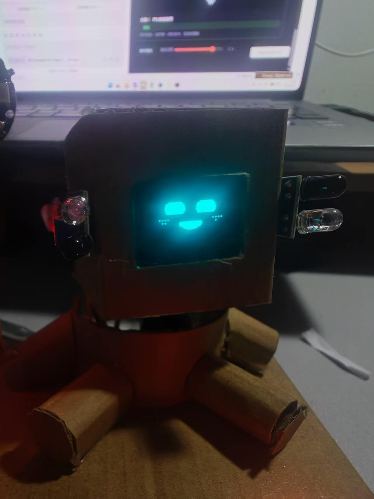

# 桌面摆件机器人 (ESP32-S3)

<p align="center">
  
</p>

一个用纸壳做的桌面摆件机器人：会喊名字、能对话、有表情、会转头点头、放歌时灯环跟着节奏律动。
硬件是一块 ESP32-S3-N16R8 + 一堆常见模块，外壳手工裁剪纸壳即可。

```
   ┌─────────────── 纸壳外壳 ───────────────┐
   │  OLED 表情屏 (SSD1305 128x64)          │
   │  舵机 x2  → 头部左右转 / 上下点头        │
   │  WS2812 灯环 → 音乐律动 / 灯效          │
   │  INMP441 麦克风 + MAX98357A 功放        │
   │  触摸 x2 (摸头/摸身体) + 红外 x2 (跟手)  │
   └────────────────────────────────────────┘
```

## 功能

| 功能 | 说明 |
|---|---|
| AI 对话 | 小智协议 (WebSocket + Opus)，唤醒词「你好小智」，也支持免触摸 VAD 直说 |
| 人格引擎 | 心情/精力/无聊/亲密度四个内在状态，空闲时自己转头看、犯困打盹 |
| 认同点头 | AI 回复里出现「你说得对/没错」会点头，出现「不对/错了」会摇头 |
| 表情 | 52 种情绪，弹簧跟随 + 眨眼 + 呼吸 |
| 在线音乐 | 网易云音乐（需自建代理 + 扫码登录），放歌时灯环律动 |
| 网页控制台 | 主页面 + 8 个子页面（音乐/表情/灯环/动作/声音/屏幕/网络/系统） |
| 配网 | 开热点 + DNS 强制门户，手机连上自动弹配置页 |

## 目录结构

```
main/                  固件源码 (ESP-IDF 5.5)
  xiaozhi.c            小智 AI 客户端 (WS + Opus + 唤醒词 + 状态机)
  persona.c            人格引擎 (心情/精力/无聊/亲密度 → 自主转头)
  music.c              网易云在线音乐 (网络读取/解码/播放/断点续传)
  light.c              WS2812 灯效引擎 (含音乐律动)
  mcp.c                MCP 工具 (AI 可以控制灯/舵机/音量/音乐)
  web_page.h           网页控制台 (主页面 + 子页面)
components/            本地组件 (face 表情 / servo / ws2812 / robot_audio ...)
server/music_proxy.js  网易云音乐代理服务端 (零依赖, Node 18+)
docs/WIRING.md         接线说明 (电源/充电/开关/各配件)
docs/MUSIC_PROXY.md    音乐代理部署 + 扫码登录说明
```

## 快速开始

### 0. 不想编译？直接下固件

到 [Releases](https://github.com/han0519/desktop-robot-companion/releases) 下载 v1.0.0 的 6 个附件，
按 Release 说明里的 esptool 一条命令烧录即可（`srmodels.bin` 是唤醒词模型，别漏）。

### 1. 烧录固件

```bash
# 需要 ESP-IDF 5.5 (含 esp-sr 唤醒词组件)
idf.py set-target esp32s3
idf.py build
idf.py -p COM5 erase-flash flash monitor
```

首次开机设备会开热点 `Robot-Config`，手机连上后随便打开一个网页会自动弹出配置页，
填家里 WiFi 的账号密码即可。

### 2. 部署音乐代理（要用在线音乐才需要）

```bash
cd server
node music_proxy.js          # 默认 3000 端口
# 浏览器打开 http://<服务器IP>:3000/ 用网易云 APP 扫码登录
```

然后在网页控制台「音乐」页填入代理地址，例如 `http://192.168.1.10:3000`。
详见 [docs/MUSIC_PROXY.md](docs/MUSIC_PROXY.md)。

### 3. 连接小智服务器

固件默认连接小智官方云 `wss://api.tenclass.net/xiaozhi/v1/`，
激活码在网页控制台「系统」页查看，到小智官方后台绑定设备即可。
也可以在「网络」页换成自建服务器。

## 接线

见 [docs/WIRING.md](docs/WIRING.md)，包含：

- 电源链路：2 串锂电池 7.4V → 充电模块 B+/B- → 开关 → 电源模块 → 各配件
- 全部信号引脚分配表（含不可用引脚说明）
- 每个模块的逐针接线表和物理位置图

## 引脚速查

| 外设 | 引脚 |
|---|---|
| 功放 MAX98357A | BCLK=5, LRC=6, DIN=7, SD=4 |
| 麦克风 INMP441 | SCK=9, WS=10, SD=11 |
| OLED SSD1305 | SDA=17, SCL=18 |
| 触摸 TTP223 | 头部=15, 身体=16 |
| 红外 FC-51 | 左=38, 右=39 |
| 舵机 SG90 | 左右转=12, 上下点=13 |
| WS2812 灯环 | DATA=3 |
| DHT11 | DATA=8 |

## 常用操作

| 操作 | 效果 |
|---|---|
| 摸头顶 1 下 | 撸猫（害羞表情，心情+亲密度+） |
| 摸头顶 2 下 | 切换灯效 |
| 摸头顶 3 下 | 音乐 暂停/继续 |
| 喊「你好小智」 | 开始对话 |

## License

MIT
